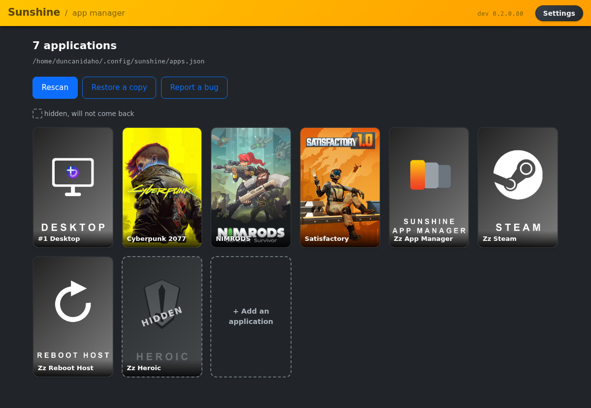
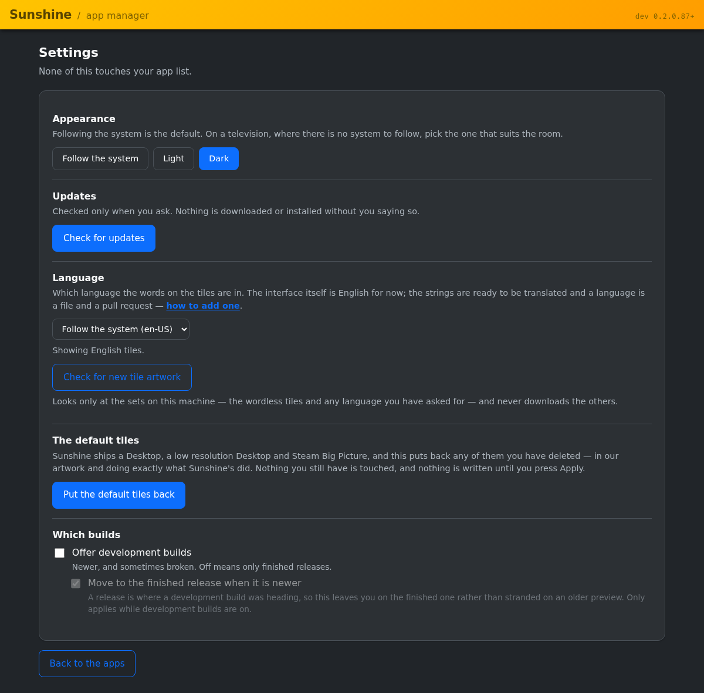
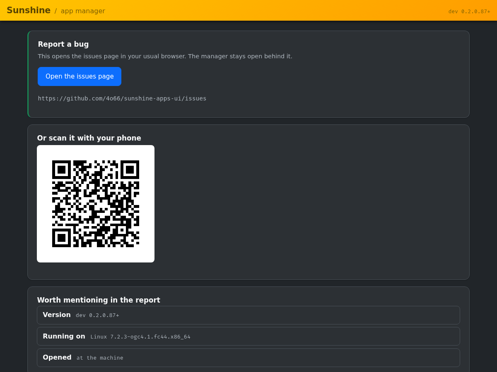
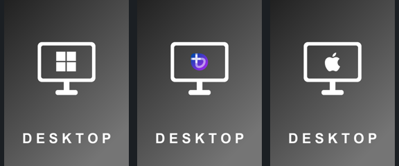

# Sunshine App Manager

Put your games on the Sunshine grid, from the sofa.

It finds what Steam and Heroic have installed, gives each one artwork, and
writes them into Sunshine's `apps.json` — and it does that from a window you
open **through Moonlight, on the television you are already looking at**. No
keyboard, no SSH, no editing JSON on a laptop in another room.



## What it is

A small program that runs on the machine Sunshine runs on, and manages the
list of applications Sunshine offers.

- **Reached the way you already reach that machine.** It appears in Moonlight
  as a tile like any other. Press it and the manager fills the screen. It is
  also in the Start menu, or your application grid, if you are sitting at the
  machine.
- **The same program on Windows and Linux.** One codebase, one interface.
  Where a platform needs something different — and they do — that difference is
  in the program, not in your head. macOS runs the engine and the interface
  today, but not the part that opens the window; see below.
- **It owns only what it made**, with one deliberate exception. Entries it
  did not create are never touched — except Sunshine's own default tiles,
  which it adopts while they are exactly as installed, so you get one set of
  tiles rather than two. Anything you have edited it leaves alone and tells
  you about. Every write is preceded by a backup.
- **What it downloads, and when.** The tiles it draws itself — the launchers,
  the desktop, this manager — ship with it and are never fetched. Game covers
  come from Steam's own cache on your disk where they are there, and from
  Steam's CDN where they are not; SteamGridDB is asked only if you give it a
  key. On Windows the installer fetches a checksum-verified CPython, Pillow,
  and the WebView2 SDK, because a Windows machine has none of them. Tile
  artwork for a language other than English is fetched from this project's own
  repository when you ask for it in Settings, and every file is checked against
  a published hash before it is kept. Nothing is fetched from a third party's
  repository behind your back.

## Installing

### Windows

**Open PowerShell** — press Start, type `powershell`, press Enter. You do not
need to run it as administrator.

Copy this whole block, paste it into the window, and press Enter. It downloads
the release, unblocks it, and installs — you do not need to fetch anything
yourself:

```powershell
$zip = "$env:TEMP\sunshine-apps-ui.zip"
$dir = "$env:TEMP\sunshine-apps-ui"
Invoke-WebRequest -UseBasicParsing -Uri `
  "https://github.com/4o66/sunshine-apps-ui/releases/latest/download/sunshine-apps-ui.zip" `
  -OutFile $zip
Remove-Item -Recurse -Force $dir -ErrorAction SilentlyContinue
Expand-Archive -Path $zip -DestinationPath $dir -Force
Get-ChildItem -Recurse $dir | Unblock-File
$inner = (Get-ChildItem $dir -Directory | Select-Object -First 1).FullName
powershell -ExecutionPolicy Bypass -File "$inner\scripts\install.ps1"
```

`Unblock-File` is there because Windows marks anything downloaded from the
internet and will otherwise refuse to run the script. Nothing in the block
needs administrator rights.

You do not need Python. The script fetches a checksum-verified CPython if the
machine has none, installs under `%LOCALAPPDATA%\Programs`, lists itself in
Add/Remove Programs, and removes itself cleanly.

If the machine has no WebView2 runtime — Windows 11 does, Windows 10 often
does not — it will offer to install Microsoft's, and say exactly what it is
about to run. Declining is fine; a browser is used instead.

### Linux

Open a terminal. This pulls just the release archive rather than the whole
repository:

```bash
curl -fsSL https://github.com/4o66/sunshine-apps-ui/releases/latest/download/sunshine-apps-ui.tar.gz \
  | tar xz
cd sunshine-apps-ui-* && python3 scripts/install
```

Installs under `~/.local`, needs no root, and adds a menu entry alongside
Sunshine's own.

For a faster window it needs your distribution's GTK 4 and WebKitGTK
introspection packages. **The installer offers to do this for you**, shows the
exact command, and is clear that it is the one part needing `sudo` — your
password is typed at the terminal and read by sudo, never by this program.
Saying no is fine: a browser is used instead, which works and is slower.

### macOS

**Not yet.** The engine and the interface run there — the test suite passes on
macOS and it knows where Sunshine keeps its configuration, both under Homebrew
and in the app bundle — but the launcher still opens a window the way Linux
does, which is wrong for a Mac. It is
[issue #5](https://github.com/4o66/sunshine-apps-ui/issues/5).

## Using it

Open it from Moonlight, the Start menu, or your application grid.

**The first time, it will ask you to connect.** It needs your Sunshine web
interface username and password — the same ones you use at
`https://localhost:47990` — for one purpose: telling Sunshine to re-read
`apps.json` after a change. Press **Connect** on the grid and enter them once;
they are stored with owner-only permissions beside Sunshine's own
configuration, and never passed on a command line.

You can skip it. Changes are still written, and Sunshine picks them up the
next time it restarts.

- **Rescan** looks at Steam and Heroic and stages what it finds. Nothing is
  written until you press **Apply**, and the grid shows exactly what will
  change.
- **Tiles you edit stay edited.** Rename one, give it different artwork, and a
  later scan reports the difference rather than overwriting it.
- **Delete** removes a tile; the next scan will offer it again. **Hide**
  retains the tile's configuration but prevents Sunshine from offering it to
  Moonlight, and prevents a rescan from adding it back. Un-hiding puts it back
  exactly as it was.
- **Restore a copy** puts back any previous `apps.json`. One is saved before
  every write.
- **Close the manager** shuts it down and takes the window with it, for when
  you have looked and nothing needs changing. Anything you have staged and not
  applied is still there next time.



Settings holds appearance (system, light or dark), the language the tiles are
written in, a check for newer tile artwork, the button that puts Sunshine's
default tiles back, the update channel, and a manual update check. None of it
touches your app list, and nothing there downloads anything without being
asked.

**Report a bug** shows a QR code so you can finish the job on whatever device
suits you: scan it and the issue page opens on your phone, where you have a
keyboard and can paste a log, rather than typing into a television. At the
machine it opens your browser instead.



### The tiles it writes



Artwork is drawn to Sunshine's own template so the grid looks like one set,
and the Desktop tile shows which machine you are connecting to. On Linux that
is your distribution's logo, from the handful we ship — Arch, Bazzite, Debian,
Fedora, Mint and Ubuntu, matched on the `ID` in `/etc/os-release` — and Tux for
everything else, which is right anywhere.

**The tiles carry words, so they carry a language.** English and a wordless set
ship with the program; a machine set to anything else gets the wordless tiles,
because a picture with no words is correct in every language while an English
one is confidently wrong. Settings has a language selector, and will fetch a
worded set for your language if somebody has drawn one. The artwork picker
offers both versions of any tile of ours, so you can have the English words on
a French machine if you would rather.

Tiles are named `#1 Desktop` and `Zz Steam` on purpose: Sunshine and Moonlight
both sort alphabetically with no way to reorder by hand, so the prefixes put
the desktop first and the launchers last, out of the middle of your games.

Sunshine ships tiles of its own — Desktop, Low Res Desktop and Steam Big
Picture on Linux; Desktop and Steam Big Picture on Windows, which has no low
resolution one. Where they are still exactly as installed, the first scan
adopts them:
they get our names, our artwork and our sort prefixes, and they keep doing
precisely what they did before, down to the resolution switch behind Low Res
Desktop and the way Windows opens Big Picture. Otherwise you would have two desktop tiles in two styles. If you have
already changed one — any artwork but the one Sunshine shipped — it is yours,
and we leave it alone.

Delete one of them and a rescan will not offer it back, the way it does for the
tiles we generate: there is nothing left to claim. Settings has a **Put the
default tiles back** button for exactly that.

## More

| | |
|---|---|
| Security, and why the server binds to loopback | [docs/security.md](docs/security.md) |
| Translating it | [docs/i18n.md](docs/i18n.md) |
| How the tile artwork is made | [docs/tile-art.md](docs/tile-art.md) |
| Releases and version numbers | [docs/releasing.md](docs/releasing.md) |
| Why it is shaped this way | [docs/design.md](docs/design.md) |
| Decisions and their reasons | [docs/backlog.md](docs/backlog.md) |
| How this was built, and how it was tested | [docs/ai-usage.md](docs/ai-usage.md) |

## Licence

The program is **GPL-3.0-or-later**. See [LICENSE](LICENSE).

It also carries artwork that is not ours. Each piece is listed below with
where it came from and under what terms; [NOTICE](NOTICE) has the same list in
full, and [docs/tile-art.md](docs/tile-art.md) records how each is used.

### Artwork we drew

The three-cover mark, the monitor, the reboot arrow, the Windows panes, and
every tile background. GPL-3.0-or-later, like the rest.

### Artwork under a compatible licence

| | from | terms |
|---|---|---|
| Steam roundel | Sunshine's own `steam.png` (LizardByte) | GPL-3.0 |
| Heroic shield | Heroic Games Launcher | GPL-3.0 |
| Tux | Larry Ewing, Simon Budig, Garrett LeSage | Attribution |
| Arch "Crystal" icon | Arch Linux | GPL |
| Debian swirl | Debian | CC BY-SA 3.0 |
| Fedora icon | Fedora | public domain |
| Linux Mint mark | Linux Mint | CC BY 3.0 |
| Ubuntu circle of friends | Canonical | GPL-3.0 |

These marks are **vendored into this project and redistributed with it**,
under the terms above — the Desktop tile for each distribution is rendered
here, not composited from whatever icons happen to be on your machine. That is
a deliberate change from how it once worked, and the reasoning is in
[docs/tile-art.md](docs/tile-art.md).

### Trademarks, used only to say what a tile launches

Each of these is used **nominatively** — to identify the software or platform
a tile starts, and for no other purpose.

- **Steam** and the Steam logo are trademarks of **Valve Corporation**. This
  project is not affiliated with, sponsored by, or endorsed by Valve.
- **Heroic Games Launcher** and its logo are trademarks of their respective
  owners. This project is not affiliated with, sponsored by, or endorsed by
  them.
- **Windows** is a trademark of **Microsoft Corporation**. This project is not
  affiliated with, sponsored by, or endorsed by Microsoft.
- **macOS** and the Apple logo are trademarks of **Apple Inc.**, registered in
  the U.S. and other countries. The Apple logo is rendered from the path Apple
  publishes on apple.com. This project is not affiliated with, sponsored by,
  or endorsed by Apple.
- **Linux** is a registered trademark of **Linus Torvalds**.
- **Arch Linux**, **Debian**, **Fedora**, **Linux Mint**, **Ubuntu**,
  **Bazzite** and every other distribution name or logo shown are trademarks
  of their respective projects or owners. This project is not affiliated with,
  sponsored by, or endorsed by any of them.
- **Sunshine** and **Moonlight** are the projects this one works with, and are
  the property of their respective maintainers. This project is not part of
  either.

If you own one of these marks and would rather it were not used here, open an
issue and it will be removed.
